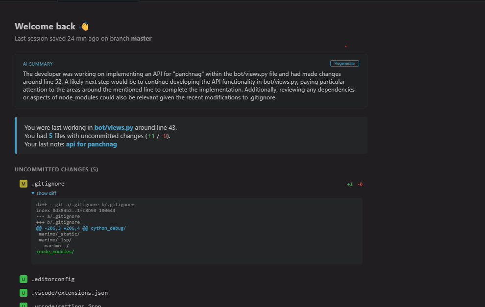
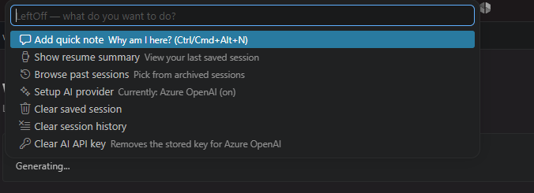

# LeftOff

<p align="center">
  
</p>

<h1 align="center">Resume Where You Left Off</h1>

<p align="center">
  <strong>A VS Code extension that remembers <em>why</em> you were working on something — not just the git changes.</strong><br>
  Automatic context capture • Quick notes • Rich resume panel with optional AI summaries • Session history
</p>

<p align="center">
  <a href="https://marketplace.visualstudio.com/items?itemName=AnandShah.leftoff">
    
  </a>
  <a href="https://marketplace.visualstudio.com/items?itemName=AnandShah.leftoff">
    
  </a>
  <a href="https://github.com/AnandShah10/leftoff/stargazers">
    
  </a>
  <a href="https://github.com/AnandShah10/leftoff/blob/main/LICENSE">
    
  </a>
</p>

## ✨ Key Features

- **🔄 Automatic Context Capture** — Open tabs with cursor positions, active editor, terminal names, current git branch, **and detailed uncommitted diffs** (insertions/deletions + colorized snippets). Powered by VS Code's built-in Git API.
- **📝 Quick "Why" Notes** — `Ctrl+Alt+N` (or click the status bar icon) to record your intent at the current file and line. No more forgetting context!
- **🎨 Beautiful Resume Panel** — On reopen (or session boundary), get a rich overview: your last note, change statistics, collapsible colorized diffs, open files/terminals, and an **optional AI-generated summary** of what you were doing + suggested next steps.
- **📜 Session History** — Automatically archives previous sessions (up to 15). Browse any past session with the same rich panel — invaluable after weekends or longer breaks.
- **🧠 Smart Session Boundaries** — Configurable triggers for ending a session: editor restart (always), returning from idle (default 30min), or switching git branches. No more stale context.
- **🤖 Multi-Provider AI Summaries** (opt-in) — Choose from Google Gemini (free tier), Local LLMs (Ollama, LM Studio, etc.), OpenAI, Anthropic, or Azure OpenAI. Guided one-click setup, keys stored securely, nothing leaves your control.
- **⚡ Frictionless UX** — Status bar icon with dropdown menu (`Ctrl/Cmd+Alt+L`). No Command Palette diving required. Works automatically in the background.

**Privacy-first**: AI only sends minimal context (notes, file paths, truncated diffs) to *your* chosen provider when the resume panel opens. No telemetry, no data collection.

## 📸 Screenshots & Demo

### The Resume Panel


*Your notes, total diff stats, per-file collapsible colorized diffs, open files list, terminals, and AI summary all in one beautiful webview.*

### Status Bar Quick Menu


*One-click access to Add Note, Show Resume, Browse History, Setup AI, and more.*

## 🚀 Quick Start

1. **Install** from the [VS Code Marketplace](https://marketplace.visualstudio.com/items?itemName=AnandShah.leftoff)
2. Open any workspace — LeftOff activates automatically on startup
3. Edit files, switch branches, open terminals as normal
4. Add a **Quick Note** with <kbd>Ctrl</kbd>+<kbd>Alt</kbd>+<kbd>N</kbd> (macOS: <kbd>Cmd</kbd>+<kbd>Alt</kbd>+<kbd>N</kbd>)
5. Close and reopen the VS Code window (or trigger idle return / branch switch) to see the **"Welcome Back"** panel

### Enable AI Summaries (Highly Recommended)

- Click the **LeftOff** status bar item (or use the menu command)
- Select **"Setup AI Provider"**
- Choose **Gemini** (free tier) or your preferred provider
- Follow the guided prompts for API key and settings

The resume panel will now include a concise, context-aware AI summary.

## 📋 Commands & Keybindings

| Command | Keyboard Shortcut | Description |
|---------|-------------------|-------------|
| `LeftOff: Add Quick Note` | <kbd>Ctrl/Cmd</kbd>+<kbd>Alt</kbd>+<kbd>N</kbd> | Capture "why am I here?" note tied to current location |
| `LeftOff: Open Menu` | <kbd>Ctrl/Cmd</kbd>+<kbd>Alt</kbd>+<kbd>L</kbd> | Quick dropdown with all actions |
| `LeftOff: Show Resume Summary` | - | Re-open the current session's resume panel |
| `LeftOff: Browse Past Sessions` | - | Select from archived sessions |
| `LeftOff: Setup AI Provider` | - | Guided wizard for AI configuration |
| `LeftOff: Clear AI Provider API Key` | - | Remove stored credentials |

## ⚙️ Configuration

Works great out of the box. Customize via VS Code Settings (search for `leftoff`):

**Key Settings**
- `leftoff.enableAiSummary`: `false` (turn on for AI summaries)
- `leftoff.idleThresholdMinutes`: `30` (0 to disable idle-based boundaries)
- `leftoff.detectBranchSwitch`: `true`
- AI provider/model options, diff capture limits (`maxDiffFiles`, `maxSnippet*`), history size, AI prompt tuning (`aiMax*`)

See the full table and descriptions in the extension's **Features** tab or [DEVELOPMENT.md](DEVELOPMENT.md).

## 🔧 Technical Details

- **Debounced capture** (2s for cursor moves, instant for notes and major events)
- **Diff-aware** using VS Code's Git extension API (no shell commands)
- **Per-workspace storage** via `workspaceState`
- **Smart history** with reasons for session end ("restart", "idle return", "branch switch")
- **Secure AI** — keys in VS Code SecretStorage, minimal data sent only on resume panel open

For complete architecture, file-by-file breakdown, local development, packaging, and publishing instructions, see **[DEVELOPMENT.md](DEVELOPMENT.md)**.

## 📜 What's New

See the full history in [CHANGELOG.md](CHANGELOG.md). The VS Marketplace displays this file directly.

## 🤝 Contributing

Bug reports, feature requests, documentation improvements, and code contributions are all welcome!

- See [CONTRIBUTING.md](CONTRIBUTING.md) for guidelines
- See [CODE_OF_CONDUCT.md](CODE_OF_CONDUCT.md)
- See [DEVELOPMENT.md](DEVELOPMENT.md) for setup

## 📄 License

This project is licensed under the [MIT License](LICENSE).

---

**Built with ❤️ by [Anand Shah](https://github.com/AnandShah10) to help developers maintain context and get back into flow state faster.**

*If you find LeftOff useful, please star the repo on GitHub and leave a review on the [Marketplace](https://marketplace.visualstudio.com/items?itemName=AnandShah.leftoff)! Feedback and ideas are always appreciated — open an [issue](https://github.com/AnandShah10/leftoff/issues).*

- **No command palette required.** Click the note icon in the status bar to leave a quick note, or the **▾** arrow next to it for a menu with everything else — resume summary, history, AI setup, clearing data. `Ctrl/Cmd+Alt+N` and `Ctrl/Cmd+Alt+L` are the keyboard shortcuts for the two, if you prefer.
- **Quick notes**: `Ctrl+Alt+N` / `Cmd+Alt+N` (or the status bar button) opens a one-line prompt to jot down *why* — tied to whatever file/line you had focused.
- **On reopen**: shows a "Welcome back" panel — active file + line, total diff stats, your last note, a collapsible diff per changed file, all open files, and terminals.
- **Session history.** Every time you reopen the project, the previous session is archived (up to the last 15). Run **"LeftOff: Browse Past Sessions"** to pick any of them from a list and view the same resume panel for that point in time — useful when you didn't touch a project for a week and need more than just "yesterday."
- **Smart session boundaries.** A "session" no longer has to end at editor restart. Two more triggers close out the current session and archive it to history automatically: **returning after being idle** past a configurable threshold, and **switching git branches**. Both are on by default and configurable — see "Smart session boundaries" below.

## Known limitations (by design)

- **Terminal scrollback/cwd is not captured.** VS Code's extension API doesn't expose arbitrary shell history or working directory for terminals it didn't create — only the terminal's name/title is stored as a memory cue.
- **Diffs are capped, not exhaustive.** To keep `workspaceState` small and fast, capture is limited to the first 20 changed files, and each snippet is truncated to ~40 lines / 3000 chars (full stats — insertions/deletions — are still counted from the untruncated diff). Untracked/newly-added files are recorded by name only (nothing exists in HEAD to diff against).

- **Per-workspace, not global.** Session state is stored via `workspaceState`, so each project has its own independent memory.
- **Idle detection is focus-based, not truly idle-based.** "Away" is measured as "the VS Code window lost OS focus for N minutes," not keyboard/mouse inactivity while focused — if you leave the window focused but walk away, that isn't detected. There's also a small race window right at the moment focus returns where a same-tick editor event could beat the archive-and-reset to the punch; rare in practice, not something to design around yet.
- **Debounced, not real-time.** Cursor-movement events are debounced 2s before triggering a re-capture (diffing is comparatively expensive); tab switches, focus loss, and explicit note-adding always persist immediately.

## Smart session boundaries

A session is archived to history (and the resume panel shown, same as reopening the editor) whenever any of these happen:

1. **Editor restart** — the original behavior. Always on.
2. **Idle return.** If the VS Code window loses focus for at least `leftoff.idleThresholdMinutes` (default **30**), the moment it regains focus is treated as "welcome back": the session from before you stepped away is archived, and the resume panel opens automatically. Set to `0` to disable.
3. **Branch switch.** If `leftoff.detectBranchSwitch` (default **on**) is true and the git branch changes since the last capture, the previous branch's session is archived immediately and a new one starts — no restart or idle gap needed. Unlike idle-return, this doesn't pop the full resume panel (that would be disruptive mid-flow); instead a small notification appears with a "View archived session" action.

Each archived session in history remembers *why* it ended — "returned from idle" or "branch switch" show up next to the timestamp in **"LeftOff: Browse Past Sessions."** Sessions ended by a plain restart show no suffix.

Both idle and branch-switch boundaries reset the *notes* for the new session (so future-you doesn't see last week's note mixed into a fresh branch) but naturally still capture whatever files/diffs are live at that moment.

## AI summaries (opt-in)

Off by default, and works with any of five providers — pick whichever you already have access to:

| Provider | API key needed? | Notes |
|---|---|---|
| **Google Gemini** | Yes | Has a genuinely free tier — good default if you don't want to pay anything. |
| **Local LLM** | No | Any OpenAI-compatible server (Ollama, LM Studio, llama.cpp server, etc). Nothing leaves your machine, no cost. |
| **OpenAI** | Yes | GPT models via api.openai.com. |
| **Anthropic** | Yes | Claude models via api.anthropic.com. |
| **Azure OpenAI** | Yes | Your own Azure resource + deployment. |

**To turn it on:** click the **▾** arrow next to the LeftOff status bar icon → **"Setup AI provider"** (or run **"LeftOff: Setup AI Provider"** from the Command Palette). It walks you through picking a provider, pasting an API key if needed, and any provider-specific fields (Azure endpoint/deployment, local server URL) — no manual `settings.json` editing required. API keys are stored in VS Code's encrypted [SecretStorage](https://code.visualstudio.com/api/references/vscode-api#SecretStorage), never written to `settings.json`, never synced, never logged.

Once set up, the resume panel shows a "Generating..." spinner that fills in with a short AI-written summary once the call returns. The rest of the panel (notes, diffs, files) renders immediately and doesn't wait on it.

**What gets sent, and when:** only when AI summaries are on, and only at the moment the resume panel opens. The request includes: your quick notes (last 10), open file paths, the active file/line, git branch, and up to 8 changed files' diff stats + a truncated snippet (~800 chars each) of their diffs. No full file contents, no files outside your notes/diffs/open-tab list. See `src/aiProviders.ts` for the exact prompt construction and per-provider request format if you want to audit it.

**Model & cost:** each provider has a sensible default model (Gemini: `gemini-2.0-flash`, OpenAI: `gpt-4o-mini`, Anthropic: `claude-haiku-4-5-20251001`, local: `llama3.1`) — override via `leftoff.aiModel` if you want something else, or leave it blank to use the default. Each summary is one API call, capped at 300 output tokens. How much context goes into the prompt is tunable via `leftoff.aiMaxDiffFiles` / `aiMaxSnippetChars` / `aiMaxNotes`.

**Turning it off:** set `leftoff.enableAiSummary: false`, or use **LeftOff menu → "Clear AI API key"** to remove the stored key for whichever provider is active. If a summary comes back wrong or the call fails, use the **Regenerate** button in the resume panel rather than reopening it.

## All settings

| Setting | Default | Description |
|---|---|---|
| `leftoff.enableAiSummary` | `false` | Turn on AI-generated session summaries. |
| `leftoff.aiProvider` | `gemini` | Which provider to use: `gemini`, `local`, `openai`, `anthropic`, or `azure`. |
| `leftoff.aiModel` | *(blank)* | Model override. Blank = provider's default. |
| `leftoff.azureBaseUrl` | *(blank)* | Azure OpenAI resource endpoint. Only used when provider is `azure`. |
| `leftoff.azureDeployment` | *(blank)* | Azure OpenAI deployment name. Only used when provider is `azure`. |
| `leftoff.azureApiVersion` | `2024-06-01` | Azure OpenAI REST API version. Only used when provider is `azure`. |
| `leftoff.localBaseUrl` | `http://localhost:11434/v1` | Base URL of a local OpenAI-compatible server. Only used when provider is `local`. |
| `leftoff.maxDiffFiles` | `20` | Max changed files to capture diff info for per snapshot. |
| `leftoff.maxSnippetLines` | `40` | Max lines kept per file's diff snippet in the resume panel. |
| `leftoff.maxSnippetChars` | `3000` | Max characters kept per file's diff snippet in the resume panel. |
| `leftoff.maxHistory` | `15` | Max number of past sessions kept in history. |
| `leftoff.aiMaxDiffFiles` | `8` | Max changed files' diffs sent in the AI summary prompt. |
| `leftoff.aiMaxSnippetChars` | `800` | Max characters per file's diff sent in the AI summary prompt. |
| `leftoff.aiMaxNotes` | `10` | Max recent notes sent in the AI summary prompt. |
| `leftoff.idleThresholdMinutes` | `30` | Minutes unfocused before regaining focus counts as a new session. `0` disables. |
| `leftoff.detectBranchSwitch` | `true` | Whether a git branch switch ends the current session and starts a new one. |

## Run it locally (development)

```bash
cd leftoff
npm install
npm run compile
```

Then in VS Code:
1. Open this folder.
2. Press `F5` (or Run → Start Debugging). This launches an "Extension Development Host" window with the extension loaded.
3. In that new window, open any project, edit some files, leave a note (`Cmd/Ctrl+Alt+N`), then close and reopen the window — you'll see the resume panel.

## Package as a `.vsix` (installable file)

```bash
npm install -g @vscode/vsce   # if not already installed
vsce package
```

This produces `leftoff-0.7.0.vsix`. Install it via:
- VS Code → Extensions panel → `...` menu → "Install from VSIX..."
- or `code --install-extension leftoff-0.7.0.vsix`

## Publishing to the Marketplace

The `package.json` is publish-ready (icon, license, changelog, repository/bugs/homepage fields, keywords, publisher) — `vsce package` runs clean with no warnings. Identity is already set: publisher `AnandShah`, repo `https://github.com/AnandShah10/leftoff`. Before actually publishing:

1. **Create the GitHub repo** at `github.com/AnandShah10/leftoff` if it doesn't exist yet, and push this code there — the `repository`/`bugs`/`homepage` links in `package.json` already point at it.
2. **Register the publisher** (if not already done) at the [Marketplace publisher management page](https://marketplace.visualstudio.com/manage), using the ID `AnandShah`.
3. **Get a Personal Access Token** from Azure DevOps (the Marketplace publishing docs walk through this) and run `vsce login AnandShah`.
4. **Publish**: `vsce publish` (or `vsce publish patch`/`minor`/`major` to bump the version automatically).
5. Update `CHANGELOG.md` with each release — the Marketplace links to it directly.
6. This is currently marked `"preview": true` in `package.json` (shows a "Preview" badge on the listing) since it's pre-1.0 — remove that flag once you're confident in stability across real-world use.

## Project structure

```
src/
  extension.ts      → activation, commands, event wiring, status bar, debounce, API key handling, session-boundary detection
  sessionStore.ts    → data model (incl. DiffSnapshot, SessionEndReason) + workspaceState persistence for current session + history
  captureContext.ts  → reads live editor/terminal/git/diff state into a snapshot
  aiProviders.ts      → multi-provider AI: prompt building + Gemini/OpenAI/Anthropic/Azure/local request handling (opt-in)
  resumePanel.ts      → webview that renders the "welcome back" / historical summary + colorized diffs + AI summary
```

## Support & Issues

If you encounter any issues or have suggestions, please report them on the [Issues page](https://github.com/AnandShah10/leftoff/issues).

## License

This project is licensed under the MIT License - see the [LICENSE](LICENSE) file for details.

---

*Built with ❤️ for the VS Code community by Anand Shah.*